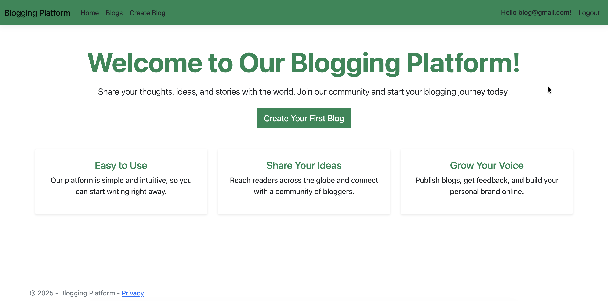
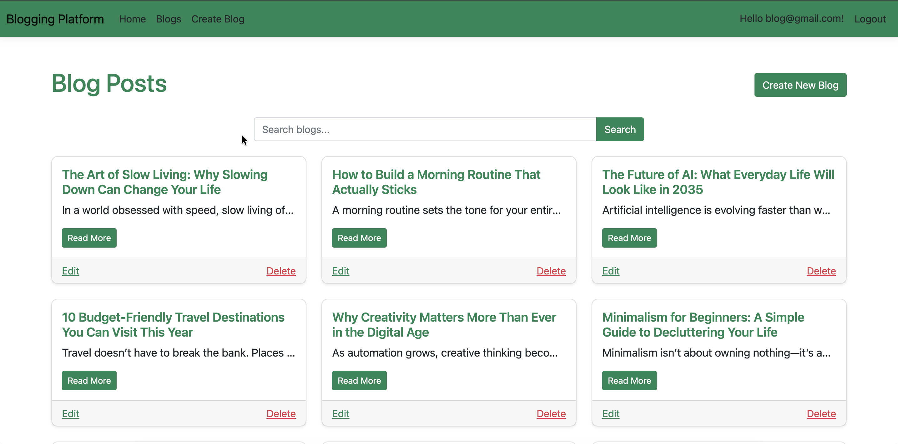
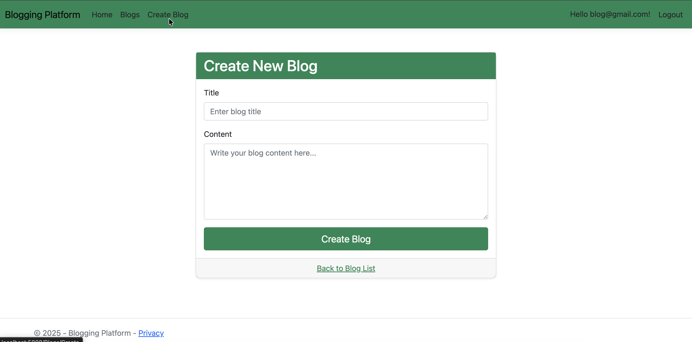

# 📝 Blog Post Application (ASP.NET C#)

A fully functional **Blog Post Application** built using **C# ASP.NET**, allowing users to create, edit, delete, and manage blog posts. This project demonstrates modern ASP.NET development practices, Entity Framework Core integration, and clean MVC architecture.

---

## 🚀 Features
- ✍️ Create, Read, Update, Delete (CRUD) blog posts  
- 🔍 Search and filter posts  
- 👤 User authentication & authorization
- 📱 Responsive UI using Bootstrap  

---

## 🛠️ Technologies Used
- **C#**
- **ASP.NET Core / ASP.NET MVC**
- **Entity Framework Core**
- **SQL Server**
- **Bootstrap 5**
- **ASP.NET Identity** (optional)

---

## 📸 ScreenShots

&nbsp;
&nbsp;
&nbsp;
&nbsp;

